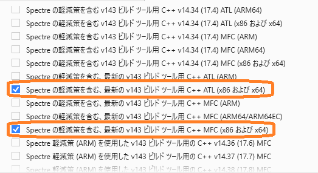
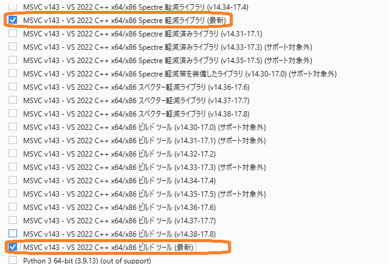

# WindowsDriverDevelopment

Windows ドライバー開発環境のインストール

Guide to getting started with Windows driver development

[https://ahidaka.github.io/WindowsDriverDevelopment/](https://ahidaka.github.io/WindowsDriverDevelopment/)

## はじめに

CQ出版社、[CQエレクトロニクスセミナー「Windows11時代のデバイス・ドライバ開発」](https://seminar.cqpub.co.jp/ccm/ES23-0142) 実習用環境のインストールと動作確認手順です。

[https://seminar.cqpub.co.jp/ccm/ES23-0142](https://seminar.cqpub.co.jp/ccm/ES23-0142)

Windows 11とWindows 10用のドライバー開発を想定しています。
従ってこの環境では、現在サポートされている全 Windows 用のデバイスドライバーを開発することが可能です。

### 参考資料

この文書は次の[「Windows Driver Kit (SDK) のダウンロード」ページ](https://learn.microsoft.com/ja-jp/windows-hardware/drivers/download-the-wdk)を参考にしています。
しかし、**この資料には一部不正確な部分があるため**、本文中で補足説明します。
**特に個別コンポーネントは、最低でもこの文書のコンポーネントを選択してインストールをお願いします。**
余計なコンポーネントのインストールは全く問題ありません。

[https://learn.microsoft.com/ja-jp/windows-hardware/drivers/download-the-wdk](https://learn.microsoft.com/ja-jp/windows-hardware/drivers/download-the-wdk)

 

 
この資料ページはブラウザの検索窓に WDK と入力して検索可能です。

 

### 準備

- Windows PC (Windows 11 または Windows 10 x64版、空きディスクスペース 50GB 以上を推奨)
- Visual Studio 2022（最新版にアップデート済、Preview版は不可、全Edition 利用可）
- ブラウザでインターネットにアクセスできる環境

続いて開発環境のインストール手順を紹介します。
 

### 検証済環境

- Visual Studio Version: 17.8.1 以降
- WDK 10.0.22621.2428: バージョン 10.1.22621.2428

インストールは次の順で行います。

- Visual Studio 2022 のダウンロード、設定とインストール
- WDKのダウンロードとインストール

Visual Studio 2022 をすでにインストール済の方は、再インストールの必要はありません。
**Visual Studio Installer** を起動して、インストール設定を確認、必要に応じて個別のコンポーネントを追加をインストールしてください。
 

## Visual Studio 設定とインストール

Visual Studio 2022 のインストール時の設定操作では、次の点に注意してください。

- 最低限は、C++によるデスクトップ開発の **ワークロード** を選択
- Windows 11 SDK (10.0.22621.0) の選択確認（デフォルトで選択済）
- MSVC v142 - VS2019 C++ x64/x86 Spectre 軽減ライブラリ（最新）ほかの **個別コンポーネント** を必ずインストール

★説明がおかしい点

手順2: SDK をインストールする
の説明は、別々の頃の名残り

- 現在ではVSとともにSDKをインストール

- Enterprise WDK (EWDK)は使用しないため、インストールしません。

#### インストール ワークロード の選択

Visual Studio のインストール時に次のワークロードを選択します。
他のワークロードを追加で選択しても構いませんが、実習では使用しません。
すでにインストール済の場合、Visual Studio Installer の変更機能を使用して、確認・変更します。

 **ワークロード選択 画面** 

#### Windows SDK 最新版 (10.0.22621.0) の選択

個別のコンポーネントネント表示がデフォルトで選択済ですが再度選択し直して右側ペインに表示させます。

#### 個別コンポーネント選択

最新版 (10.0.22621.0) SDKを含めて、各必要コンポーネントを選択、確認します。
必須なコンポーネントを次に示します。

- Windows 11 SDK (10.0.22632.0)
- MSVC v143 - VS 2022 C++ x64/x86 ビルドツール (最新)
- MSVC v143 - VS 2022 C++ x64/x86 Spectre 軽減済みライブラリ (最新)
- 最新の v143 ビルドツール用 C++ ATL (X86 および x64)
- 最新の v143 ビルドツール用 C++ MFC (X86 および x64)
- Spectre の軽減策を含む、最新の v143 ビルドツール用 C++ ATL (X86 および x64)
- Spectre の軽減策を含む、最新の v143 ビルドツール用 C++ MFC (X86 および x64)

Visual Studio Installer でのインストール時の個別コンポーネント表示順は前述の通りではありません。
表示順が異なり、似た様な名前のコンポーネントが多いため、慎重に選択します。

 

 **Spectre 軽減策を含む、最新の V143 ビルドツール用 C++ ATL/MFC 選択画面** 

 

 **Windows SDK 10.0.22621.1 と ATL/MFC 選択確認画面** 

 

 **最新MSVC v143 - VS 2022 C++ と対応 Spectre 軽減ライブラリ選択確認画面** 

 

設定を確認して「インストール」★★★

## WDK

★★★WDKのリンク
Windows Driver Kit (WDK) の **今すぐダウンロード** をクリックしてダウンロード用ページを表示します。このページの内容と URL は時々更新されます。

 **今すぐダウンロード 表示画面** 

表示されたページの中程にある、

	手順 3:Windows 11 WDK をインストールする

	WDK for Windows 11 のダウンロード

のリンクをクリックして **wdksetup.exe** を入手して実行、インストールを開始します。 
手順2 のWindows 11 SDKは前項の通り、Visual Studio 2019 に含まれるため、飛ばします。 

 **WDK のダウンロード 選択画面** 

すぐ下にある **EWDK with Visual Studio Build Tools** は、Visual Studio 無しで Windows ドライバーをビルドするツールです。
使用しないためダウンロード不要です。
 

### WDK のインストール

wdksetup.exe を実行してインストールする手順を示します。
起動画面では **Install the Windows Driver Kit - Windows 10.0.22001.1 to this computer**
を選択して **Next** で進みます。

下の選択肢の **Download the Windows Driver Kit - Windows 10.0.22001.1 for installation on a separate computer**
は、オフライン インストール用の全 WDK バイナリーのダウンロードを行います。
