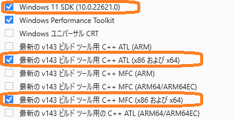
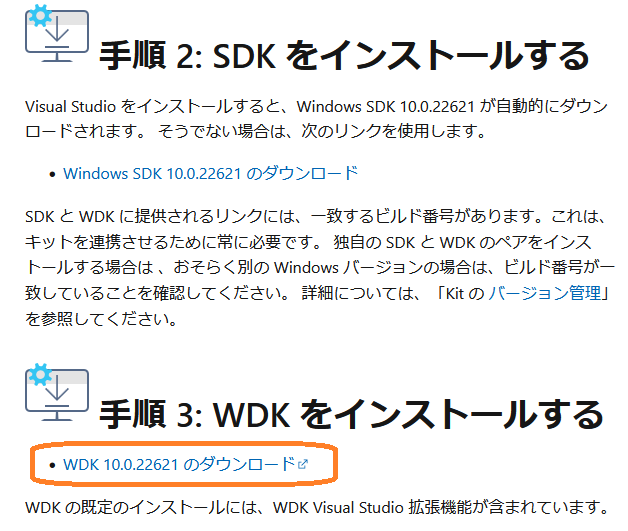
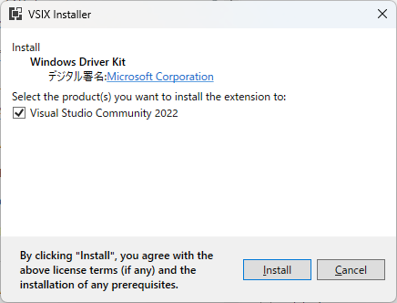

# WindowsDriverDevelopment

Windows ドライバー開発環境のインストール

Guide to getting started with Windows driver development

[https://ahidaka.github.io/WindowsDriverDevelopment/](https://ahidaka.github.io/WindowsDriverDevelopment/)

## はじめに

CQ出版社、[CQエレクトロニクスセミナー「Windows11時代のデバイス・ドライバ開発」](https://seminar.cqpub.co.jp/ccm/ES23-0142) 実習用環境のインストールと動作確認手順です。

[https://seminar.cqpub.co.jp/ccm/ES23-0142](https://seminar.cqpub.co.jp/ccm/ES23-0142)

Windows 11とWindows 10用のドライバー開発を想定しています。
従ってこの環境では、現在サポートされている全 Windows 用のデバイスドライバーを開発することが可能です。

### 参考資料

この文書は次の[「Windows Driver Kit (SDK) のダウンロード」ページ](https://learn.microsoft.com/ja-jp/windows-hardware/drivers/download-the-wdk)を参考にしています。
しかし、**この資料には一部不正確な部分があるため**、本文中で補足説明します。
**特に個別コンポーネントは、最低でもこの文書のコンポーネントを選択してインストールをお願いします。**
余計なコンポーネントのインストールは全く問題ありません。

[https://learn.microsoft.com/ja-jp/windows-hardware/drivers/download-the-wdk](https://learn.microsoft.com/ja-jp/windows-hardware/drivers/download-the-wdk)

この資料ページはブラウザの検索窓に WDK と入力して検索可能です。

### 準備

- Windows PC (Windows 11 または Windows 10 x64版、空きディスクスペース 50GB 以上を推奨)
- Visual Studio 2022（最新版にアップデート済、Preview版は不可、全Edition 利用可）
- ブラウザでインターネットにアクセスできる環境

続いて開発環境のインストール手順を紹介します。

### 検証済環境

- Visual Studio Version: 17.8.1 以降
- WDK 10.0.22621.2428: バージョン 10.1.22621.2428

インストールは次の順で行います。

- Visual Studio 2022 のダウンロード、設定とインストール
- WDKのダウンロードとインストール

Visual Studio 2022 をすでにインストール済の方は、再インストールの必要はありません。
**Visual Studio Installer** を起動して、インストール設定を確認、必要に応じて個別のコンポーネントを追加をインストールしてください。
 

## Visual Studio 設定とインストール

Visual Studio 2022 のインストール時の設定操作では、次の点に注意してください。

- 最低限 C++によるデスクトップ開発の **ワークロード** を選択
- Windows 11 SDK (10.0.22621.0) の選択確認（デフォルトで選択済）
- MSVC v142 - VS2019 C++ x64/x86 Spectre 軽減ライブラリ（最新）ほかの **個別コンポーネント** を必ず選択してインストール

### インストール ワークロード の選択

Visual Studio のインストール時に次のワークロードを選択します。
他のワークロードを追加で選択しても構いませんが、実習では使用しません。
すでにインストール済の場合、Visual Studio Installer の変更機能を使用して、確認・変更します。

 **ワークロード選択 画面** 

### Windows SDK 最新版 (10.0.22621.0) の選択

個別のコンポーネントネント表示がデフォルトで選択済ですが再度選択し直して右側ペインに表示させます。

### 個別コンポーネント選択

最新版 (10.0.22621.0) SDKを含めて、各必要コンポーネントを選択、確認します。
必須なコンポーネントを次に示します。

- Windows 11 SDK (10.0.22632.0)
- MSVC v143 - VS 2022 C++ x64/x86 ビルドツール (最新)
- MSVC v143 - VS 2022 C++ x64/x86 Spectre 軽減済みライブラリ (最新)
- 最新の v143 ビルドツール用 C++ ATL (x86 および x64)
- 最新の v143 ビルドツール用 C++ MFC (x86 および x64)
- Spectre の軽減策を含む、最新の v143 ビルドツール用 C++ ATL (x86 および x64)
- Spectre の軽減策を含む、最新の v143 ビルドツール用 C++ MFC (x86 および x64)

Visual Studio Installer インストール時の個別コンポーネント選択画面の表示順は、前述の通りではありません。
表示順が異なり、似た様な名前のコンポーネントが多いため、慎重に選択します。
Spectre 軽減策を含む、最新の V143 ビルドツール用 C++ ATLとMFC の選択画面を以下に示します。

 **Spectre 軽減策を含む、最新の V143 ビルドツール用 C++ ATL/MFC 選択画面**  

Windows SDK 10.0.22621.1 と x64/x86 のATL と MFC 選択画面を以下に示します。

 **Windows SDK 10.0.22621.1 と ATL/MFC 選択確認画面**  

最新MSVC v143 - VS 2022 C++ と対応 Spectre 軽減ライブラリ選択画面を以下に示します。

 **最新MSVC v143 - VS 2022 C++ と対応 Spectre 軽減ライブラリ選択確認画面**  

Visial Studio Installer の個別のコンポーネントの設定を確認して、右下の「インストール」ボタンをクリックして、インストールを開始します。

 **最新MSVC v143 - VS 2022 C++ と対応 Spectre 軽減ライブラリ選択確認画面**

 

## WDK をインストールする

分かり難いのですがこの前項の、「手順 2: SDK をインストールする」は、Visual Studio 2022 と同時にインストールするため、不要です。
**現在のバージョンの Visual Studio では手順2は無視して下さい。**

 **手順 2: と 手順 3: WDK をインストールする** 画面

### WDK のダウンロード

**手順 3: WDK をインストールする**  のすぐ下、**WDK 10.0.22621 のダウンロード** をクリックして「wdksetip.exe」をダウンロードします。

### WDK のインストール

wdksetup.exe を実行してインストールする手順を示します。
起動画面の「**Specify Location**」では **Install the Windows Driver Kit - Windows 10.0.22621.2428 to this computer**を選択して **Next** で進みます。
この画面ではインストール先のディレクトリを変更出来ますが、トラブルの元なので、変更しないことをお勧めします。

下の選択肢の **Download the Windows Driver Kit - Windows 10.0.226211.2428 for installation on a separate computer**
は、オフライン インストール用の全 WDK バイナリーのダウンロードを行います。

 **Specify Location の画面** 

WDKのインストール中のダイアログです。

 **Installing features.. ダイアログ** 

**Welcome to ...** は、WDK本体のインストール完了ダイアログです。これで完了ではありません。続けて Visual Studio extension （Visual Studio WDK 拡張機能）をインストールします。

 **Welcome to ... 画面** 

「Install Windows Driver Kit Visual Studio extension」チェックボックスをチェックしたまま「Close」ボタンをクリックすると、**VSIX Installer** が立ち上がり、WDK 拡張機能のインストールを開始します。

 **WSIX Installer 画面** 

拡張機能のインストール中ダイアログです。

 **WSIX Installer インストール中画面** 

拡張機能のインストール完了ダイアログです。

 **WSIX インストールが完了しました 画面** 

これで Visual Studio を起動して、Windows ドライバーを開発することが出来る様になりました。

### Enterprise WDK (EWDK)

nterprise WDK はVisual Studioが使えない、オフライン環境でのドライバー開発キットです。
今回は使用しません。

### Windows 向けのドライバー サンプル

ドライバー サンプルはこの WDK 解説通り様々な方法で入手出来ますが、リアルタイムで配布内容が異なるため、今回は使用しません。
実習では使用しませんが、興味がある方は、ダウンロードして動作確認をすることも可能です。

